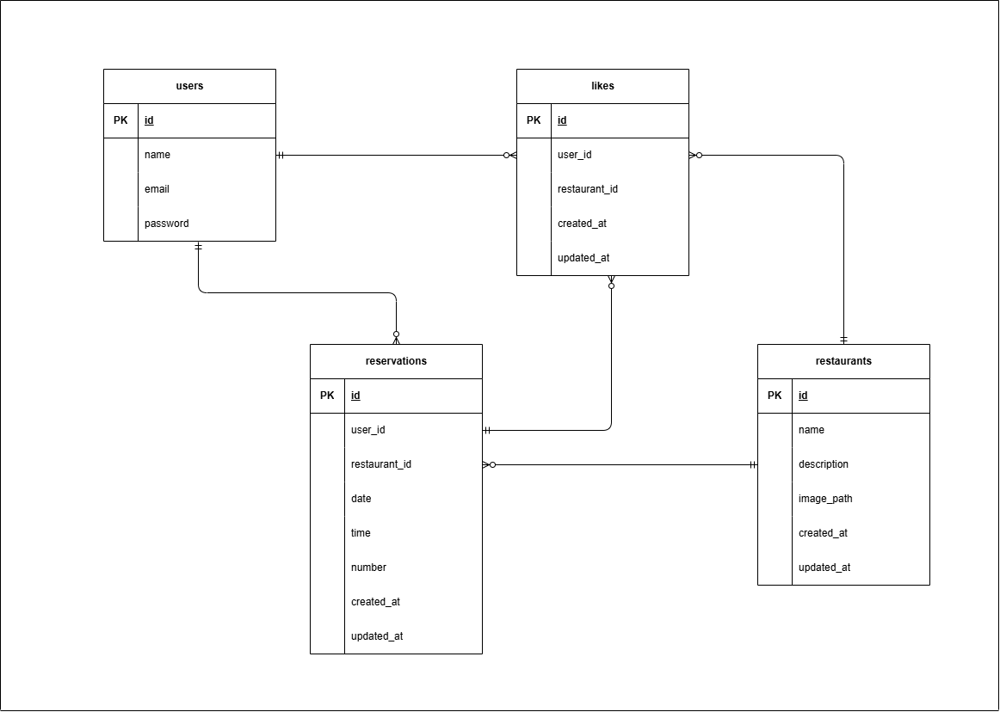

# eating-and-drinking

## 環境構築

## Docker ビルド

1. git clone git@github.com:lillian-angelina/eating-and-drinking.git
2. cd ~/coachtech/laravel/eating-and-drinking
3. docker-compose up -d --build

## Laravel のセットアップ

1. docker-compose exec php bash
2. composer install
3. .env ファイルの一部を以下のように編集

```
DB_CONNECTION=mysql
DB_HOST=mysql
DB_DATABASE=laravel_db
DB_USERNAME=laravel_user
DB_PASSWORD=laravel_pass
```

4. php artisan key:generate
5. php artisan migrate --seed

## キャッシュクリア（エラー回避のため）

1. php artisan config:clear
2. php artisan cache:clear
3. php artisan view:clear
4. php artisan route:clear

## user のログイン用初期データ
### テストユーザー1
- メールアドレス: test@example.com
- パスワード: password

## 使用技術

- MySQL 8.4.4
- PHP 8.2
- Laravel 12.0

## URL

- 環境開発: http://localhost:8082/
- phpMyAdmin: http://localhost:8081/

## ER 図


